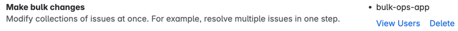

# Forge Bulk Issue Ops

# Introduction

This is a [Forge](https://developer.atlassian.com/platform/forge) app that provides alternate experiences to Jira's built-in functionality to bulk move and edit issues.

## Setup

See [Set up Forge](https://developer.atlassian.com/platform/forge/set-up-forge/) for instructions to get set up.

### Setup step 1: Installing the app

The following are brief instructions to set up the app. For detailed instructions, visit https://developer.atlassian.com/platform/forge/getting-started/.

- Register the app as your own:
```
cd [app-root-directory]
npm install
```

- Install app dependencies (backend and frontend):
```
cd [app-root-directory]
npm install
cd static/spa
npm install
```

- Build your app's frontend:
```
cd [app-root-directory]
cd static/spa
npm run build
```

- Deploy your app by running:
```
cd [app-root-directory]
forge deploy
```

- Install your app in an Atlassian site by running:
```
cd [app-root-directory]
forge install
```

### Setup step 2: Enable the app to perform bulk operations

Jira provides a global permission, called "Make bulk changes", to enable/disable the ability for users to make bulk changes. The standard configuration includes various roles, but administrators may change which roles are able to make bulk changes. To ensure the app continues to work, it is recommended that a role specific to the app be created and added to the "Make bulk changes" permission so that its purpose and association with the app is obvious.

1. Create a group called "bulk-ops-app" as follows:
* Click "User management" from the settings (cog) menu.
* Click "Directory" and "Groups".
* Click the "Create group" button.
* Enter "bulk-ops-app" and the group name.
* Click "Create" to create the group.

2. Add the "bulk-ops-app" group to the "Make bulk changes" global permission as follows:
* Visit Jira admin settings (https://your-tenant.atlassian.net/jira/settings/system/general-configuration).
* Visit "Global permissions" within the "Security" section.
* In the "Grant Permission" section, select "Grant: Make bulk changes: and "Group: bulk-ops-app". 

Once this is done, you should see the "bulk-ops-app" appear alongside the "Make bulk changes" global permission. When testing the app, it is recommended for this to be the only permission, but in a production environment, you will likely also want to allow administrators to have bulk change permissions.




### Setup step 3: Configure environment variables

In order for the app to be able to make bulk changes as the user requeting the changes, the app needs to add the requesting user into the "bulk-ops-app" group before the request is submitted and then remove the user from the group afterwards. To configure these environment variables, see the commands in the comments above the various operations in [src/userManagementConfig.ts](./src/userManagementConfig.ts). 


### Stepup step 4: Optionally prevent regular users from using Jira's built-in bulk operations

This optional step involves reviewing and tuning the access to Jira's built-in bulk operations. Visit the Jira administration global permissions section, and review the permissions corresponding to "Make bulk changes".


### Development Loop
- Run all forge commands from the `[app-root-directory]`.
- After making changes to the frontend, run `npm run start` from the `[app-root-directory]/static/spa` directory.
- Use the `forge deploy` command when you want to persist code changes or after you make changes to the app manifest.
- Use the `forge install` command when you want to install the app on a new site.
- Once the app is installed on a site, the site picks up the new app changes you deploy without needing to rerun the install command.


# Additional configuration options

Configuration options can be defined in [static/spa/src/model/config.ts](static/spa/src/model/config.ts).

# Known issues

* The move functionality does not allow the target issue type and status to be specified. It is assumed the target issue type and status exists in the target project and will therefore remain unchanged.
* Using deprecated API https://developer.atlassian.com/cloud/jira/platform/rest/v3/api-group-issues/#api-rest-api-3-issue-createmeta-get

